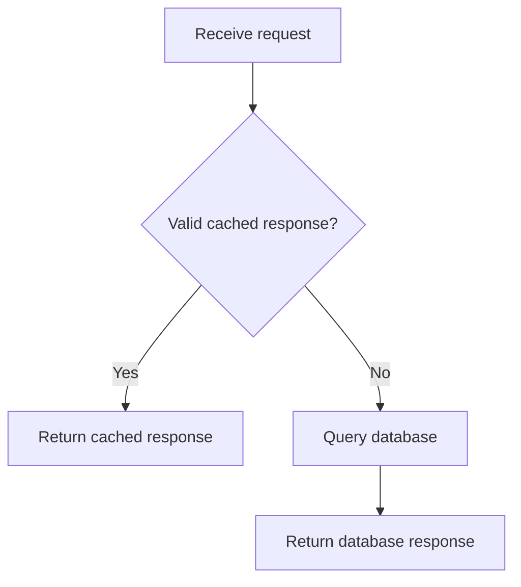

# Plain English for technical work

Consult this reference when a shorter sentence could change a condition, instruction, or technical claim. These are practical adaptations of Simplified Technical English (STE).

## Choose the clearest familiar word

Prefer a concrete verb over a noun wrapped in extra words.

Before:
> Perform a verification of the backup before you initiate the deployment.

After:
> Verify the backup before you start the deployment.

Use one term consistently for one concept. If "job" and "task" name different objects, keep both. If they name the same object, choose the term used in the product or source.

Keep established technical expressions such as "sign in," "garbage collection," and "eventual consistency." Explain an unfamiliar term instead of replacing it with a vague word.

## Make conditions explicit

Put the condition near the action it controls. Keep alternatives and their scope intact.

Before:
> Automatic retries are permitted only for requests that include an idempotency key and have failed with a timeout.

After:
> A request may be retried automatically only if it has an idempotency key and has timed out.

The passive voice preserves the source's unspecified actor. Name the actor only when the source or context identifies it.

"Only if" is a requirement for a retry. Replacing it with "if" can imply that meeting the condition is enough to cause a retry. Preserve the intended relationship.

Check these distinctions during a rewrite:

- "At most three attempts" includes the initial attempt. "Three retries" does not.
- "Not all requests succeed" does not mean that all requests fail.
- "A or B" does not mean "A and B." Preserve whether the alternatives are exclusive when the source specifies it.
- "Unless the cache is empty" is an exception, not optional background.
- "May retry" permits a retry. "Will retry" predicts one. "Must retry" requires one.

## Preserve uncertainty and time

Before:
> It is possible that the worker has stopped, but the log has not yet been checked.

After:
> The worker may have stopped. The log has not been checked yet.

The rewrite keeps both the uncertain failure and the incomplete check. "The worker stopped" would claim more than the source supports.

Use simple tenses when they mean the same thing. Keep "has finished," "was running," or "may have failed" when completion, duration, or uncertainty matters.

## Give each action room

Before:
> After the backup finishes, stop the worker and install the update, then restart the worker and check the health endpoint.

After:
> Wait for the backup to finish.
>
> 1. Stop the worker.
> 2. Install the update.
> 3. Restart the worker.
> 4. Check the health endpoint.

Keep prerequisites before the affected steps. Keep alternatives attached to the correct branch. Include an expected result only when the source supplies one.

Aim for short instructions, often around 20 words. A longer sentence is acceptable when splitting it would hide a dependency or create ambiguity.

## Explain a term when the reader needs it

Before:
> Payment requests with the same idempotency key are idempotent.

After, for a general reader:
> Repeating a payment request with the same key does not create another charge. This behavior is called idempotency.

The explanation is longer because it supplies the meaning of the term. Keep the condition "with the same key." For an expert audience, the technical version may be sufficient.

## Use a diagram for a branch

Source:
> If the cache contains a valid response, return it. Otherwise, query the database and return the database response.



Use the cached response when valid. Otherwise, query the database.

Do not add a cache write, retry, or failure branch without support in the source. In plain text, the same logic is:

```text
Request -> Valid cached response?
           Yes -> Return cached response
           No  -> Query database -> Return database response
```

For a simple instruction, a sentence is smaller and clearer than a diagram.

## Sources and adaptations

- [ASD-STE100 official site](https://www.asd-ste100.org/) and [About STE](https://www.asd-ste100.org/about_STE.html): writing rules, controlled vocabulary, and consistent technical terminology.
- [Simplified Technical English on Wikipedia](https://en.wikipedia.org/wiki/Simplified_Technical_English): background and an overview of the standard's sentence and procedure rules.

The official standard combines writing rules with an approved dictionary. EN-US uses its clarity principles with flexible sentence targets, ordinary contractions, and meaning-preserving grammar. The examples here are original. Exact STE conformance requires the official standard; this skill does not reproduce its dictionary or certify conformance.
